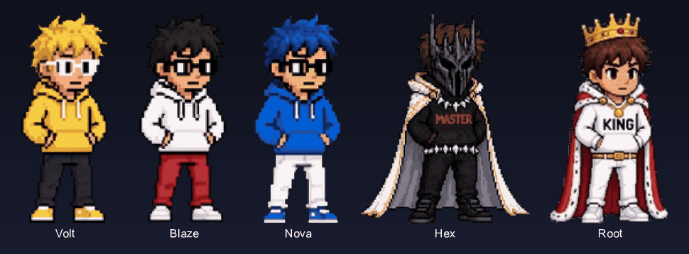
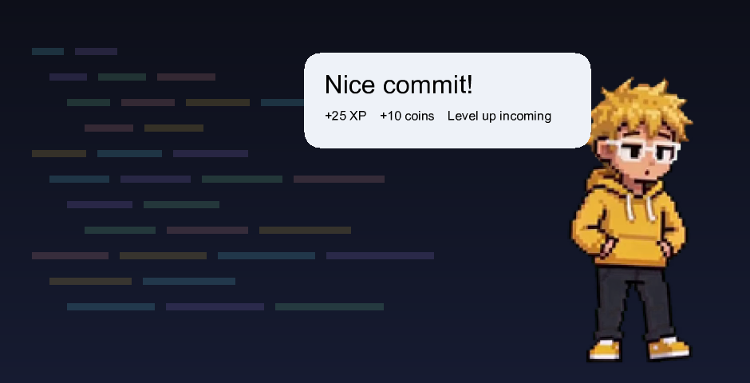
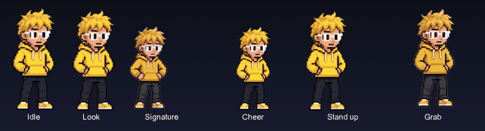
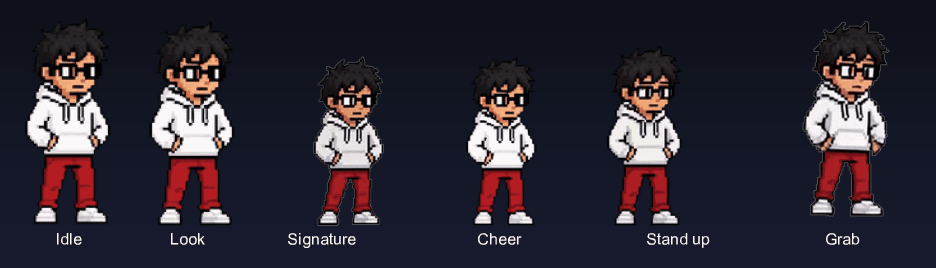
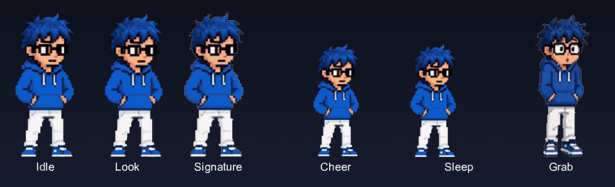
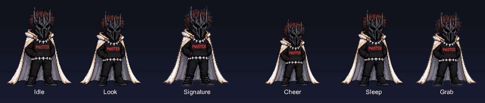
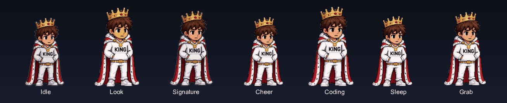
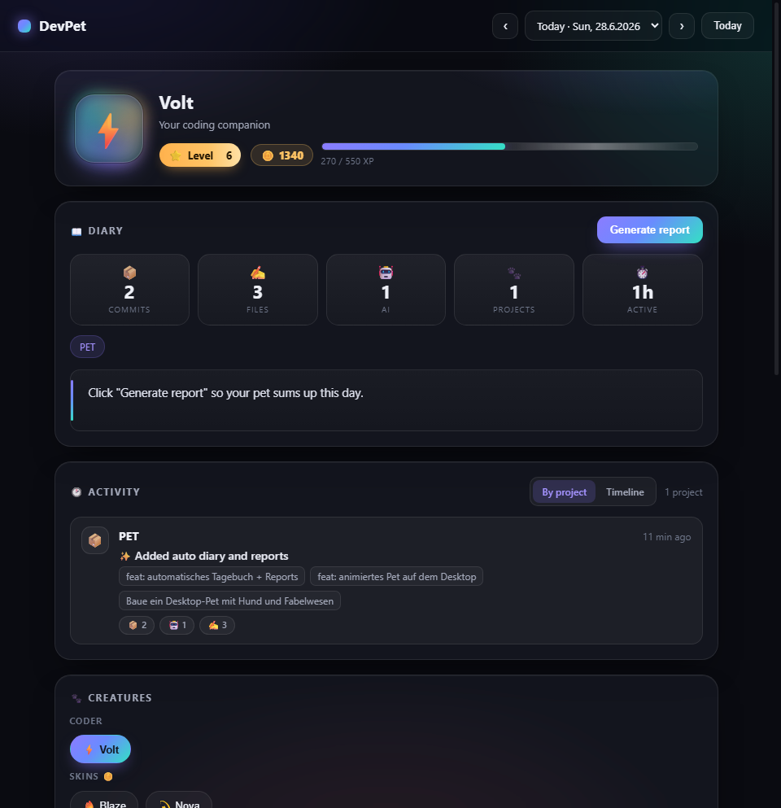
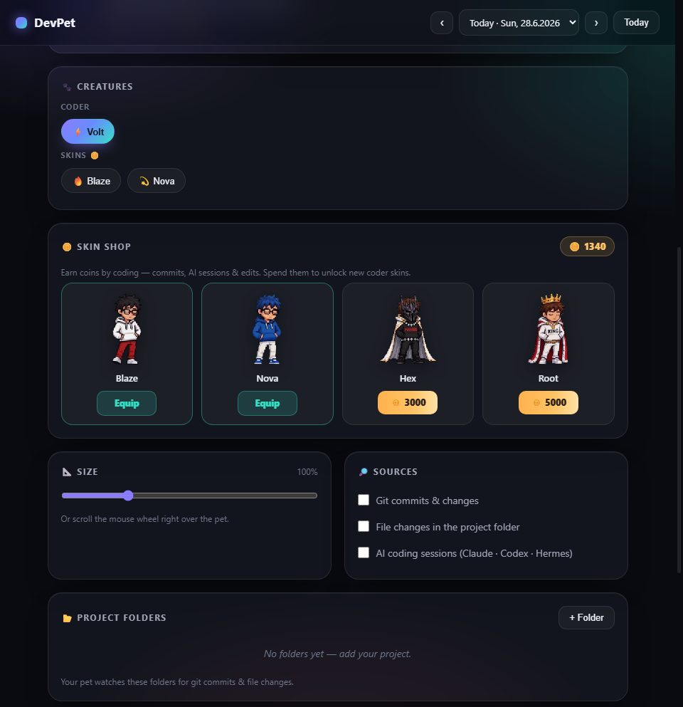

<h1 align="center">DevPet ⚡</h1>

<p align="center">
  🇬🇧 <a href="README.md">English</a> &nbsp;·&nbsp; 🇩🇪 <b>Deutsch</b>
</p>

<p align="center">
  <strong>Ein handanimierter Coding-Buddy, der auf deinem Desktop wohnt, dir beim Coden zuschaut und dein Dev-Tagebuch schreibt.</strong>
</p>

<p align="center">
  
  
  
  
  
</p>

<p align="center">
  
</p>

<p align="center">
  
</p>

<p align="center">
  <b>5 handanimierte Charaktere</b> · jeder mit <b>bis zu 8 einzigartigen Animationen</b> · 100 % lokal · Privacy-first · kein Account · keine Telemetrie
</p>

---

> **DevPet** ist ein kleines Desktop-Pet für **Windows**, gebaut mit **Electron + purem Node**. Ein kleiner, handanimierter „Coder" sitzt auf deinem Desktop in einem **transparenten, immer im Vordergrund liegenden, klick-durchlässigen** Fenster. Er **beobachtet deine Coding-Aktivität**, **reagiert live** und **schreibt dir automatisch ein Entwickler-Tagebuch** auf Deutsch oder Englisch. Das Ganze ist **gamifiziert** mit XP, Leveln, Münzen und freischaltbaren Skins — und läuft **zu 100 % lokal**: kein Account, keine Telemetrie, keine Cloud.

### ✨ Features & Highlights

| | |
|---|---|
| 🪟 **Wohnt auf deinem Desktop** | Ein transparentes Fenster im Vordergrund, das **überall klick-durchlässig ist — außer über dem Pet selbst**. Es klaut nie den Fokus und blockiert nie deine Klicks. |
| 🎬 **Handanimiert** | **5 Charaktere**, **1 gratis + 4 freischaltbar**, jeder mit **bis zu 8 einzigartigen Animationen**, gerendert als butterweiche transparente **VP9-WebM** mit echtem Alpha und übergeblendet von einer 2-Layer-Video-Engine. |
| 🧠 **Schaut dir beim Coden zu** | Drei lokale Aktivitätsquellen — **Git-Commits**, **Datei-Edits/-Bursts** und **AI-Coding-Sessions** (Claude Code + Codex) — jede einzeln an-/abschaltbar. |
| 💬 **Reagiert live** | Bei jedem erkannten Event spielt es eine Reaktion, zeigt eine **DE/EN-Sprechblase** und kann sie **vorlesen** per kostenlosem **Edge TTS** (jeder Skin hat seine eigene Stimme). |
| 📔 **Automatisches Dev-Tagebuch** | Tägliche Einträge aus deiner echten Aktivität, **nach Projekt gruppiert**, mit Statistiken — funktioniert **komplett offline**, optional von einer KI veredelt. |
| 🎮 **Gamifiziert** | Verdiene **XP** und **Münzen** beim Coden, steige mit Konfetti im **Level** auf und gib deine Münzen im eingebauten **Münz-Shop** für neue Skins aus. |
| 🔒 **Privacy-first** | Alles läuft **auf deinem Rechner**. Das Einzige, was ihn jemals verlassen kann, ist eine optionale KI-Tagebuch-Zusammenfassung — mit **deinem eigenen** API-Key, nur wenn du das aktivierst. |
| 🪶 **Leichtgewichtig** | Nach wie vor nur **zwei native Runtime-Abhängigkeiten** — `uiohook-napi` + `nut-js` treiben die Makro-Engine an; alles andere ist **pures Node + Electron**. (`jimp` ist nur ein Dev-Tool.) |
| ⚙️ **Automatisiere den langweiligen Kram** | **Nimm Maus+Tastatur auf und spiel sie ab**, und lass DevPet **sich wiederholende Aktionen erkennen** und vorschlagen, ein Makro daraus zu machen — immer von dir geprüft & freigegeben, nie automatisch ausgeführt. |
| 🏆 **Echter Coding-Begleiter** | **Erfolge**, **Coding-Streaks**, ein **Pomodoro-Fokus-Timer**, sanfte **Wellness-Erinnerungen** und ein **Frag-dein-Pet**-Chat, der nur auf deinen echten Stats basiert. |

### 🎬 Lern die Truppe kennen

**5 handanimierte Coder-Charaktere** — einer gratis als Standard, vier freischaltbar im In-App-Münz-Shop.

| Emoji | Name | Persönlichkeit | Status |
|:---:|:---|:---|:---|
| ⚡ | **Volt** | Energiegeladener BVB-gelber Funke | **Gratis** (Standard) |
| 🔥 | **Blaze** | Feurig und mühelos cool | Freischalten für **600** 🪙 |
| 💫 | **Nova** | Kosmischer Träumer mit Sternenlicht in den Augen | Freischalten für **1500** 🪙 |
| 😈 | **Hex** | Dunkler Trickster, der bei Kerzenschein codet | Freischalten für **3000** 🪙 |
| 👑 | **Root** | Der gekrönte Superuser — Root-Zugriff auf alles | Freischalten für **5000** 🪙 |

<p align="center">
  
</p>

Jeder Skin teilt sich ein Kern-Animationsset, und jeder hat einen **exklusiven persönlichen Signature-Move**, der einmal abgespielt wird, wenn sich deine Maus nähert.

#### ⚡ Volt — der energiegeladene Funke
<p align="center"></p>

> Idle · Look · **Signature** (ein Fußball-Torjubel ⚽) · Cheer · Stand up · Grab

#### 🔥 Blaze — feurig cool
<p align="center"></p>

> Idle · Look · **Signature** (ein cooler Flammen-Snap 🔥) · Cheer · Stand up · Grab

#### 💫 Nova — kosmischer Träumer
<p align="center"></p>

> Idle · Look · **Signature** (ein Sternenlicht-Ruf 💫) · Cheer · Sleep · Grab

#### 😈 Hex — dunkler Trickster
<p align="center"></p>

> Idle · Look · **Signature** (ein Runenkreis dunkler Macht 😈) · Cheer · Sleep · Grab

#### 👑 Root — der gekrönte Superuser
<p align="center"></p>

> Idle · Look · **Signature** (ein königlicher Befehl 👑) · Cheer · **Coding** (eine exklusive Tipp-Animation während AI-/Coding-Sessions) · Sleep · Grab

#### Das Animationsset

| Animation | Wann sie abspielt |
|:---|:---|
| 🪑 **Idle** | Sitzt und arbeitet an der Tastatur. |
| 👀 **Look** | Reagiert und bemerkt es, wenn dein Mauszeiger näher kommt. |
| ⭐ **Signature** | Ein **exklusiver persönlicher Move**, einzigartig pro Skin, spielt einmal, wenn sich deine Maus nähert. |
| 🎉 **Cheer** | Feiert bei einem Git-Commit, beim Level-Up oder wenn du es anklickst/anstupst. |
| 😴 **Sleep** | Nickt nach **75 Sekunden** Inaktivität ein 💤. |
| 🌅 **Stand up** | Wacht wieder auf, wenn du zurückkommst. |
| ✊ **Grab** | Eine „Hochgehoben"-Reaktion, während du es herumziehst. |
| ⌨️ **Coding** | **Nur Root 👑** — eine zusätzliche exklusive Tipp-Animation während AI-/Coding-Sessions. |

### 🧠 Was es beobachtet

DevPet hat **drei lokale Monitore**. Sie fassen das Netzwerk nie an — sie lesen Aktivität von deinem eigenen Rechner, und **jeder lässt sich einzeln an- oder abschalten**.

| Monitor | Was er tut | Belohnung |
|:---|:---|:---:|
| 🌱 **Git-Commits** | Beobachtet die Git-Historie deiner überwachten Ordner. | 🏆 die größte Belohnung |
| 📝 **Datei-Edits / -Bursts** | Bemerkt, wenn du in deinen überwachten Ordnern aktiv Dateien bearbeitest. | klein |
| 🤖 **AI-Coding-Sessions** | Liest **Claude Code** (`~/.claude/projects/**/*.jsonl`) und **Codex**-Session-Logs, um zu erkennen, wenn du mit einer KI pair-programmierst. | mittel |

Wird etwas erkannt, spielt das Pet eine Reaktion, lässt eine **Sprechblase** (DE/EN) aufpoppen und kann sie **vorlesen**. Ein **Level-Up** löst eine Feier mit **Konfetti** und einem gesprochenen Jubel aus. 🎊

### 📔 Das Dev-Tagebuch

Ein eigenes Fenster, das dein Entwickler-Tagebuch **für dich** schreibt. Tägliche Einträge werden aus deiner echten Aktivität generiert, **nach Projekt gruppiert**, mit Statistiken: Commits, bearbeitete Dateien, AI-Sessions und der Zeitraum, in dem du gearbeitet hast.

<p align="center">
  
</p>

> 💡 Das Tagebuch funktioniert **komplett offline** mit einem eingebauten Template-Writer (Deutsch **und** Englisch). Optional kann es von einer KI veredelt werden — für schöneren Text und Zusammenfassungen pro Projekt — via **DeepSeek** (am günstigsten, bevorzugt), **MiniMax** oder **Claude/Anthropic**. API-Keys sind **zu 100 % optional** und für die Kern-App **nie erforderlich**.

Öffne das Tagebuch per **Doppelklick auf das Pet** oder über das **Tray**.

### 🎮 Leveln & Münz-Shop

Dein Pet **steigt im Level auf, während du codest**. Jedes Event bringt **XP** und **Münzen** 🪙 — Commits sind am meisten wert.

| Event | XP | Münzen 🪙 |
|:---|:---:|:---:|
| 🌱 **Git-Commit** | **25** | **10** |
| 🤖 **AI-Session** | **8** | **3** |
| 📝 **Datei-Burst** | **3** | **1** |
| ⬆️ **Level-Up-Bonus** | — | **+20** |

Die Level-Kurve ist eine sanfte Wurzelfunktion:

| Level | 2 | 3 | 4 | 5 | … |
|:---|:---:|:---:|:---:|:---:|:---:|
| **Gesamt-XP** | 50 | 200 | 450 | 800 | … |

Gib deine Münzen im eingebauten **Münz-Shop** (im Tagebuch-Fenster) aus, um neue Skins freizuschalten — Blaze, Nova, Hex und Root. Dein **Level** und dein **Münz-Kontostand** werden auch im Tray angezeigt.

<p align="center">
  
</p>

### 🕹️ Interaktionen

| Aktion | Ergebnis |
|:---|:---|
| 🖱️ **Ziehen** | Bewege das Pet überallhin auf dem Bildschirm. |
| 🖱️ **Mausrad-Scrollen** darüber | Ändert die Größe des Pets. |
| 🖱️🖱️ **Doppelklick** | Öffnet das Dev-Tagebuch. |
| 👉 **Klick / Anstupsen** | Lässt es jubeln **und** sprechen. |
| 🖱️ **Rechtsklick** | Öffnet das Kontext-/Tray-Menü. |

**Tray-Menü:** Skin wechseln · Tagebuch öffnen · Position auf den Bildschirm zurücksetzen · Autostart umschalten · Beenden.

> Das Fenster ist **überall klick-durchlässig — außer über dem Pet selbst**, damit es deiner Arbeit nie im Weg ist.

### ⚙️ Makro-Aufnahme & -Wiedergabe

DevPet ist jetzt auch ein **leichtgewichtiges Automatisierungs-Tool**. Drück **`Strg+Alt+R`**, um deine Maus und Tastatur aufzunehmen, mach die Sache einmal, und drück dann nochmal, um zu stoppen. Du bekommst eine **menschenlesbare Zusammenfassung**, was genau du getan hast — echte Schritte, kein bloßer Zähler — damit du sie prüfen, benennen und speichern kannst. Spiel jedes gespeicherte Makro mit **`Strg+Alt+P`** ab (oder per ▶-Klick im Tagebuch), und DevPet trackt die **eingesparte Zeit**.

> 🛑 **Sicher by Design.** Jede Wiedergabe startet mit einem **3-Sekunden-Countdown** (Sprechblase), damit du ins richtige Fenster wechseln (oder abbrechen) kannst. Wiedergaben laufen **nur bei einer expliziten Aktion** — einem Hotkey oder einem ▶-Klick. Nichts wird jemals automatisch aufgenommen, gespeichert oder abgespielt.

### 🔍 Smarte Muster-Erkennung

Coden steckt voller kleiner Wiederholungen. DevPet bemerkt leise, wenn du **dieselbe kurze Aktion — oder dieselbe getippte Phrase — 3× hintereinander** machst, sogar **app-übergreifend** (in Excel kopieren → wechseln → in Outlook einfügen), und lässt eine freundliche *„das mache ich schon 3×…"*-Sprechblase aufpoppen — mit einem **Vorschlag im Tagebuch**, ein Makro daraus zu machen.

- 👀 Es **schlägt immer nur vor** — du prüfst und gibst frei, exakt wie bei einer manuellen Aufnahme. Es **speichert oder startet nie von selbst**.
- 🔒 **Sensible Fenster sind hart ausgeschlossen** von der Text-Erkennung — Passwort-Manager, Banking, Login-/Anmelde-Formulare und `.secrets`-Fenster werden nie gepuffert, nicht mal kurzzeitig.
- 🎚️ Es hat einen **eigenen, sichtbaren Schalter** (größerer Privacy-Fußabdruck als der Rest der App) und lässt sich mit einem einzigen Klick abschalten.

### 🏆 Erfolge

**13 freischaltbare Trophäen**, jede mit einem **Fortschrittsbalken** für die, die du noch nicht hast.

| | Trophäe | Wie du sie bekommst |
|:---:|:---|:---|
| 📦 | **Erster Commit** | Mach deinen ersten Commit |
| 📦 | **Committed** / 🏗️ **Baumeister** | 50 / 250 Commits |
| 🦉 | **Nachteule** | 10 Commits nach 23 Uhr |
| 🤖 | **KI-Teamwork** | 25 KI-Coding-Sessions |
| ⚙️ | **Automatisierer** | 10 Makros freigeben |
| ⏱️ | **Zeitsparer** | 50× Makros abspielen |
| 🎯 | **Fokussiert** / 🧘 **Deep Work** | 10 Fokus-Sessions / 10 Stunden Fokuszeit |
| 🔥 | **Wochen** / **Monats** / 💎 **Hundert** | 7- / 30- / 100-Tage-Streaks |
| ⭐ | **Level 10** | Erreiche Level 10 |

### 🔥 Coding-Streaks

Halt das Feuer am Brennen — DevPet trackt einen **täglichen Coding-Streak**, der mit jedem aktiven Tag wächst. Das Leben kommt dazwischen, deshalb kannst du Münzen für 🧊 **Freeze-Token** ausgeben, die **einen verpassten Tag überbrücken** (genau wie ein Streak-Freeze) und deinen Lauf am Leben halten.

### 🎯 Fokus-Sessions

Ein eingebauter **Pomodoro-Timer** (Standard **25 Min.**) mit **Live-Countdown**. Schließ die volle Session ab, und sie zählt für die Erfolge **Fokussiert** und **Deep Work** — brichst du früher ab, gibt's — wie bei einem echten Pomodoro — nichts. Derselbe „Zieh durch, was du anfängst"-Anreiz.

### 🧘 Wellness-Erinnerungen

Während eines langen, ununterbrochenen Coding-Abschnitts (Standard **nach 90 Minuten**) gibt DevPet dir eine **sanfte Streck-/Trink-Erinnerung** — *„schon lang dran! Kurz aufstehen, trinken, Augen entspannen?"* Reine Heads-up-Sprechblase, gekoppelt an echte Arbeitssignale: keine extra Erfassung, kein Tagebuch-Eintrag, kein XP.

### 💬 Frag dein Pet

Ein **Chat direkt im Tagebuch**, in dem du Fragen zu **deiner eigenen Coding-Aktivität** stellen kannst — *„wie viele Commits diese Woche?"*, *„woran habe ich am meisten gearbeitet?"* Das Pet antwortet **nur auf Basis deiner echten Stats** (keine erfundenen Fakten), mit dem **gleichen optionalen API-Key** wie das Tagebuch (DeepSeek / MiniMax / Claude). Es behält ein **sitzungsweites Gedächtnis**, damit Folgefragen einfach funktionieren.

### 📱 Mobiler Begleiter (LAN)

Eine winzige **nur-lesende, token-geschützte lokale Webseite**, damit ein Handy im **selben WLAN** einen Blick auf dein Pet werfen kann — **Level, Streak, Münzen und den Fokus-Countdown**. Sie läuft auf **Port `4827`** und **zeigt nie Tagebuch-Text, Prompts oder Tastenanschläge** — nur die paar Zahlen, die eh im Tray-Tooltip stehen.

### ☁️ Optionales Cloud-Relay

Willst du **von überall** nach deinem Pet schauen, nicht nur im selben WLAN? Du kannst dich für ein **Cloud-Relay** entscheiden — einen **Cloudflare Worker, den du selbst deployst** und der denselben winzigen Status-Schnappschuss empfängt.

> ⚠️ **Das ist der einzige Weg, auf dem überhaupt Daten deinen Rechner verlassen.** Es ist **OPT-IN und standardmäßig AUS**, und selbst dann sendet es nur den **winzigen Gamification-Schnappschuss** (Level, Streak, Münzen, Fokus-Countdown, letzte Reaktions-Zeile) — **nie irgendeinen Aktivitäts-Inhalt**, Tagebuch-Text, Makros oder Tastenanschläge.

### 🖼️ Teilbare Recap-Karte

Ein Klick erzeugt eine schicke **PNG-„Coding-Woche/-Tag"-Karte** — Commits, bearbeitete Dateien, KI-Sessions, gesparte Zeit, Level und Streak — gespeichert in einem **Exports-Ordner** und **in die Zwischenablage kopiert**, bereit zum Einfügen überall dort, wo du deine Woche zeigen willst. 🎉

### 🔒 Privatsphäre & API-Keys

- **Standardmäßig zu 100 % lokal.** Kein Account. Keine Telemetrie. Kein Cloud-Sync.
- 🔍 Die **Muster-Erkennung** beobachtet lokale Tastenanschläge/Klicks im Hintergrund, um Wiederholungen zu erkennen — sie ist **abschaltbar**, **sensible Fenster sind ausgeschlossen**, und **es wird nie etwas irgendwohin gesendet**. Aufgenommene **Makros werden lokal gespeichert**.
- 📱 Die **mobile LAN-Seite** ist **nur im selben WLAN**, **token-geschützt** und **nur-lesend** — sie nimmt nie Schreibzugriffe an und verlässt nie das lokale Netzwerk.
- ☁️ Das **Cloud-Relay ist der einzige Opt-in-Weg von deinem Gerät weg** — standardmäßig AUS, und selbst dann pusht es nur den **winzigen Status-Schnappschuss** (kein Aktivitäts-Inhalt).
- 🤖 Das **Einzige**, was per KI rausgeht, ist eine **optionale Tagebuch-Zusammenfassung / Frag-dein-Pet-Antwort** — erzeugt mit **deinem eigenen** API-Key, **nur wenn du** das aktivierst.
- API-Keys sind **optional** und werden lokal in `.secrets/` oder als Umgebungsvariablen gespeichert. Sie sind **nie erforderlich** — ohne Key nutzt das Tagebuch den eingebauten Offline-Template-Writer.

### 🚀 Loslegen

> **Voraussetzungen:** Node 18+ und Windows 11 (das Pet-Fenster ist auf Windows abgestimmt).

```bash
git clone https://github.com/MauricePutinas/devpet
cd devpet
npm install
npm start
```

Das war's — dein Pet erscheint auf dem Desktop. 🎉

> ⚙️ **Zu `npm install`:** Es zieht jetzt auch die **zwei nativen Module** für die Makro-Engine (`uiohook-napi` + `nut-js`). Auf **Windows 11** kommen die als **vorkompilierte Binaries**, also gibt's normalerweise nichts zu kompilieren — die Installation läuft einfach durch.

> 🪟 **Windows-Ein-Klick:** Statt Terminal kannst du auch einfach **`Start DevPet.bat` doppelklicken** — installiert beim ersten Mal die Abhängigkeiten und startet das Pet (es bleibt kein Konsolenfenster offen).

**Optional — KI-Tagebuch-Zusammenfassungen aktivieren:** Lege eine API-Key-Datei unter `.secrets/deepseek.key` (oder `.secrets/minimax.key`) ab. Andernfalls nutzt das Tagebuch fröhlich den Offline-Template-Writer.

### 🧩 Technik & wie es gebaut ist

- **Electron + pures Node** — nur **zwei native Runtime-Abhängigkeiten**: **`uiohook-napi`** (globale Eingabe-Erfassung für Aufnahme & Muster-Erkennung) und **`@nut-tree-fork/nut-js`** (Eingabe-Wiedergabe für Makro-Replay). Alles andere ist pures Node. (`jimp` ist ein reines Dev-Asset-Tool.)
- **Transparentes Pet-Fenster** — immer im Vordergrund, klick-durchlässig, fokus-sicher, auf Windows 11 abgestimmt.
- **2-Layer-Video-Engine** — blendet zwischen **transparenten VP9-WebM**-Clips mit echtem Alpha über, für butterweiche Übergänge.
- **Asset-Pipeline** — rohe handgezeichnete Animationen laufen durch eine Pipeline (`scripts/normalize-poses.js`, `scripts/process-chroma.js`, …), die **chroma-keyed**, am **Boden verankert** und jede Pose als sauberes transparentes WebM exportiert.
- **Lokale Monitore** — Git-, Datei- und AI-Session-Reader, alle auf dem Gerät.
- **Makro-Engine** — ein Recorder, ein Menschenlesbar-Schritt-Zusammenfasser und ein countdown-geschützter Player, dazu Klick- und Text-Muster-Detektoren, die immer nur *vorschlagen*.
- **Winziger lokaler HTTP-Server** — Nodes eingebautes `http` treibt die token-geschützte mobile Seite im selben WLAN an (keine extra Abhängigkeit).
- **Kostenloses Edge TTS** — gibt jedem Skin seine eigene Stimme, ganz ohne API-Kosten.

### 📁 Projektstruktur

```text
devpet/
├─ src/
│  ├─ main/                # Electron-Hauptprozess
│  │  ├─ monitors/         # Git-, Datei- & AI-Session-Watcher
│  │  ├─ automation/       # Makro-Engine + Muster-Erkennung
│  │  │                    #   recorder · player · macroStore · humanize
│  │  │                    #   patternDetector · textPatternDetector
│  │  │                    #   keymap · sensitiveWindows · activeWindow
│  │  ├─ diary/            # Tagebuch-Store + Reporter
│  │  ├─ streaks.js        # täglicher Coding-Streak + Freeze-Token
│  │  ├─ lanServer.js      # nur-lesende, token-geschützte Status-Seite (selbes WLAN)
│  │  ├─ tray.js · tts.js  # Tray-Menü + Edge-TTS-Stimmen
│  │  └─ progress.js       # XP, Level & Münzen
│  ├─ preload/             # Context-Bridge-API
│  ├─ renderer/
│  │  ├─ pet/              # transparentes Pet-Fenster + State Machine
│  │  ├─ diary/            # Dev-Tagebuch, Münz-Shop, Makros & Frag-dein-Pet-UI
│  │  └─ recap/            # Renderer der teilbaren Recap-Karte (→ PNG)
│  └─ shared/              # Creatures-Liste, Erfolge, geteilte Helfer
├─ scripts/                # Asset-Pipeline (rohe Anim → transparentes WebM)
├─ cloudflare/             # optionaler Opt-in-Cloud-Relay-Worker
└─ assets/
   └─ creatures/<id>/      # WebM-Animationen + Thumbnails pro Skin
```

### 📜 Lizenz

Veröffentlicht unter der **MIT-Lizenz**. Gebaut mit ❤️ und Claude von **Maurice**.

---

## 📝 Änderungsprotokoll

> 🤖 Dieser Abschnitt wird bei **jedem Push automatisch** von einer GitHub Action aktualisiert — so sieht jeder, was wann geändert wurde.

<!-- CHANGELOG:START -->

### 2026-06-30

- ✨ feat: automatic daily &amp; weekly DeepSeek reports + activity cards show edited files and expand on click `52ad5e6`

### 2026-06-29

- 🐛 fix: stop .gitignore from excluding src/diary dirs — add missing diary UI + reporter + store `a64749d`
- ✨ feat: crash-proof config (auto-backup + atomic write + recovery) and live-refresh the diary on focus `31c7e55`
- 🐛 fix(changelog): match the bot's update commits by subject prefix, keep human commits `61e5d6c`
- 🐛 fix(changelog): exclude the bot's own [skip ci] commits from the changelog `4b1c364`
- ✨ feat: add one-click Start DevPet.bat launcher (Windows) + README note `bec4eae`
- 📝 docs: lighter, funnier LinkedIn post (just-for-fun vibe) `14216ba`
- ✨ feat: initial release — DevPet desktop pet with auto dev-diary, 5 animated skins &amp; gamified coin shop `939642a`

<!-- CHANGELOG:END -->

---

<p align="center">
  <sub>⚡ <b>DevPet</b> — Dein Code hat jetzt einen Zeugen.</sub>
</p>
